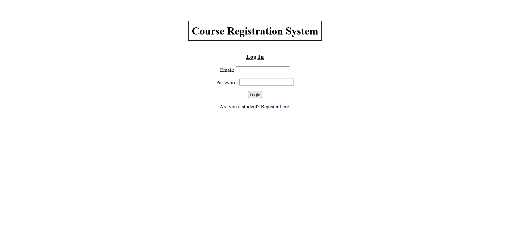
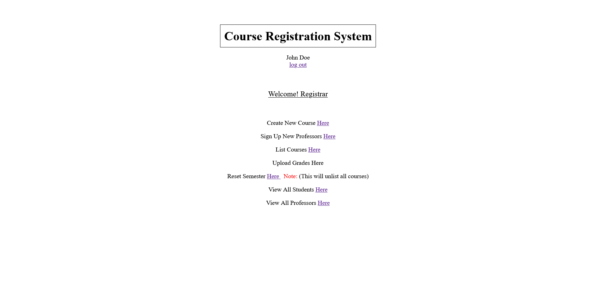
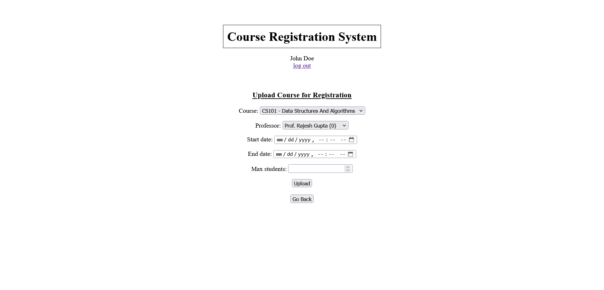
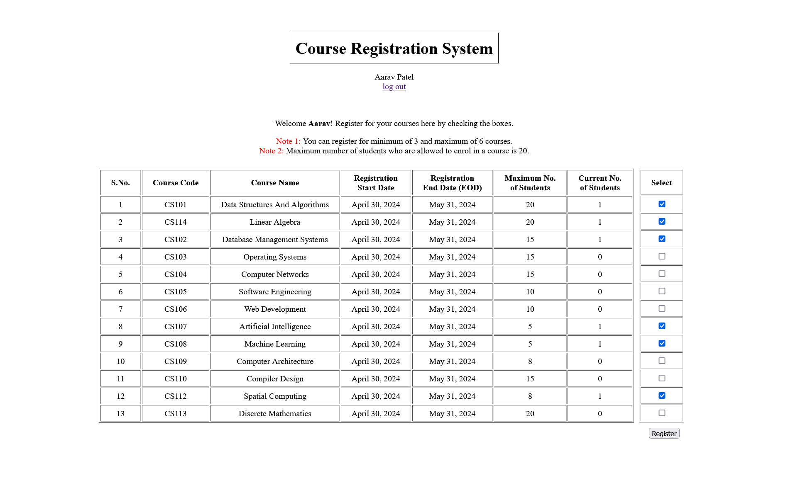
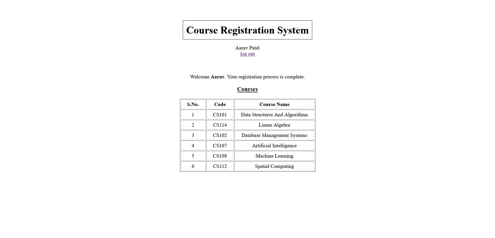
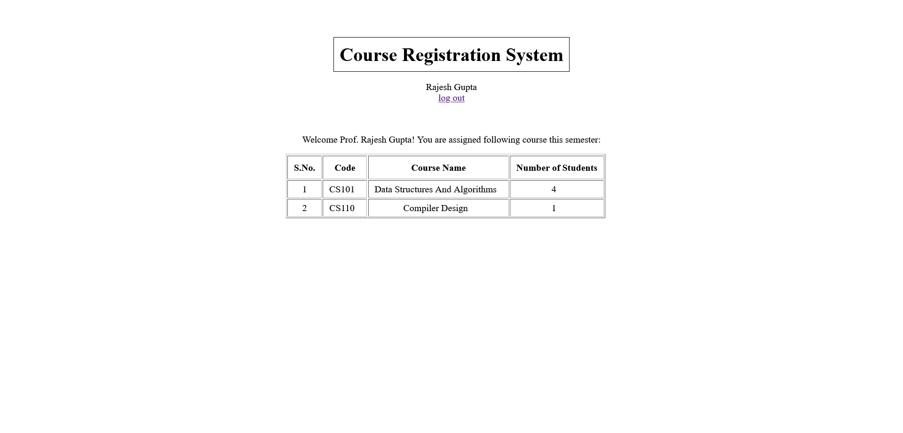

# Course Registration System

## Description

The Course Registration System is a Django project that allows students to register for courses. It provides separate portals for students, professors, and registrars, each with specific functionalities tailored to their roles.

The project uses the default SQLite database management system configured in Django settings. It includes normalized model classes and a user flow to determine which users have access to specific functionalities. Many other database management systems can also be integrated with this project; more about that can be found here: https://docs.djangoproject.com/en/5.0/topics/install/#database-installation

Current list of students, professors and courses up can be found in . This folder also include python scripts to create objects of model classes.

Login details for registrar are as follows: (Use these to login as registrar)

email: registrar101@example.com

password: hello!world

## Features

- **Authentication**: Users can log in with their credentials and are directed to a specific portal based on their role.
- **User Registration**: Students can sign up directly on the login page, while professors can only be signed up by the registrar.
- **Registrar Portal**:
  - Create Courses
  - Sign Up Professors
  - List Courses with Assignments
  - View Lists of Professors and Students
  - Reset Semester
- **Professor Portal**:
  - View Assigned Courses and Number of Students Registered
- **Student Portal**:
  - Register for Courses
  - View Registered Courses
  

## Screenshots

### Login Page

*Login Page*

### Registrar Homepage

*Registrar Homepage*

### List Course

*List Course*

### Student Homepage

*Student homepage when he has not registered for any course*

### Student Homepage

*Student homepage when he has completed registeration*

### Professor Homepage

*Professor Homepage*

## Tech/Framework Used

- Django
- HTML
- CSS
- Javascript

## Installation

1. Clone the repository
   ```bash
   git clone https://github.com/your_username/course-registration-system.git
   ```
2. Navigate to the project directory
   ```bash
   cd course-registration-system
   ```
3. Install dependencies
    ```bash
   pip install -r requirements.txt
    ```
5. Setup database. SQLite is default DBMS integrated with django
   ```bash
   DATABASES = {
    'default': {
        'ENGINE': 'django.db.backends.sqlite3',
        'NAME': BASE_DIR / 'db.sqlite3',
      }
    }
   ```
  
6. Apply migrations to make database tables.
  ```bash
  python manage.py makemigrations
  python manage.py migrate
  ```
7. Start the development server
    ```bash
   python manage.py runserver
    ```

## Usage

1. Access the project through your web browser.
2. Log in with your credentials.
3. Navigate through the respective portals based on your role.
4. Perform the desired actions as described in the Features section.


## Contributing

1. Fork the repository.
2. Create a new branch.
3. Make your changes.
4. Test your changes thoroughly.
5. Commit your changes and push to your fork.
6. Create a pull request.

## Contact

For any inquiries or support, please contact [paras_gill@outlook.com](mailto:paras_gill@outlook.com).
